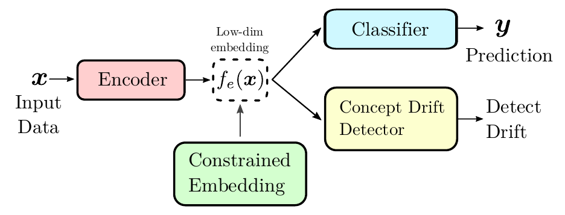

# Task-Sensitive Concept Drift Detector with Constraint Embedding
This repository contains the implementation of the methods proposed in the paper [Task-Sensitive Concept Drift Detector with Constraint Embedding](https://arxiv.org/abs/2108.06980) by Andrea Castellani, Sebastian Schmitt and Barbara Hammer (submitted at SSCI 2021).

<div align="center">


Fig 1: Proposed Concept Drift architecture.
</div>

[arXiv:2108.06980](https://arxiv.org/abs/2108.06980) Abstract:

> <div align='justify'>Detecting drifts in data is essential for machine learning applications,  as changes in the statistics of processed data typically has a profound influence on the performance of trained  models. Most of the available drift detection methods are either supervised and require access to the true labels during inference time, or they are completely unsupervised and aim for changes in distributions without taking label information into account.We propose a novel task-sensitive semi-supervised drift detection scheme, which utilizes label information while training the initial model, but takes into account that supervised label information is no longer available when using the model during inference. It utilizes a constrained low-dimensional embedding representation of the input data. This way, it is best suited for the classification task. It is able to detect real drift, where the drift affects the classification performance, while it properly ignores virtual drift, where the classification performance is not affected by the drift. In the proposed framework, the actual method to detect a change in the statistics of incoming data samples can be chosen freely. Experimental evaluation on nine benchmarks datasets, with different types of drift, demonstrates that the proposed framework can reliably detect drifts, and outperforms state-of-the-art unsupervised drift detection approaches.</div>

## Requirements
- Ubuntu 18.04.5
- Python 3.7+
- NumPy 1.20+
- SciPy 1.6.3
- PyTorch 1.4.0+
- Matplotlib 3.3.2
- Scikit-Learn 0.23.2
- Cuda 10.0+
- Alibi Detect 0.7.0
- Scikit-Multiflow 0.5.3

Install dependencies:
```bash
conda install pytorch numpy scipy matplotlib scikit-learn -c torch
conda install -c conda-forge scikit-multiflow
pip install alibi-detect
```

### Folder structure

```bash
.
├── data/                           # real-world dataset folder
│   └── ...
├── src/                            # code folder
│   ├── models/               
│   │    ├── MLP.py                 # contains the models and meta-models used in the experiments
│   ├── utils/                      # contains helper functions
│   │    ├── constraint_module.py   # contains the constraint module
│   │    ├── drift_detector_meta.py # meta-class for several drift detectors
│   │    ├── drift_detectors.py     # contains several drift detector algorithms
│   │    ├── drift_helper.py        # utility functions for drift detection algorithms
│   │    └── ...
│   ├── main_experiments.py         # contains the experiments. User friendly interface to set various parameters for different dataset/hyperparameters. Parallel implementation on single GPU.
├── results/                        # results folder (generated after the first run)
│   ├── <scriptname>/               # results organized by scriptname/datetime 
│   │   ├── <datetime>/
│   │   └── ...
│   └── ...
└── ...
```


### TODO
Usage example.
Documentation.


## Acknowledgements
The real-world dataset used in this paper are obtained from the [ConceptDriftInudction repository](https://github.com/tegjyotsingh/ConceptDriftInduction).


## Citing
If this code has been useful, please cite us:
```BibTex
@misc{castellani2021tasksensitive,
      title={Task-Sensitive Concept Drift Detector with Constraint Embedding}, 
      author={Andrea Castellani and Sebastian Schmitt and Barbara Hammer},
      year={2021},
      eprint={2108.06980},
      archivePrefix={arXiv},
      primaryClass={cs.LG}
}
```

## Contacts
For any question, bug or other, do not hesitate to open a pull request and contact me directly via email:
Andrea Castellani - acastellani@techfak.uni-bielefeld.de - a.castellani93@gmail.com
